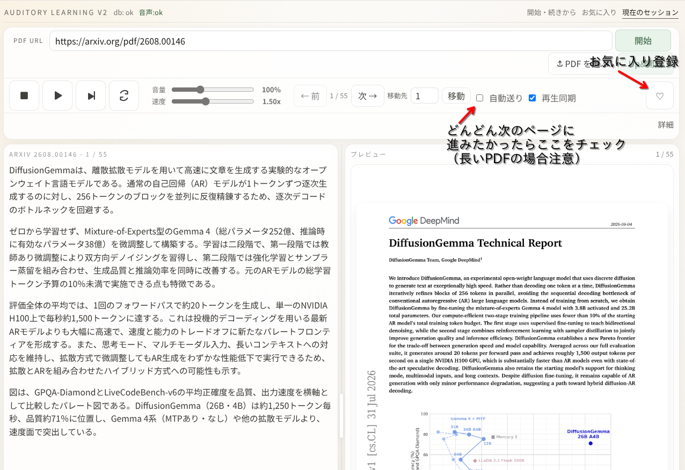
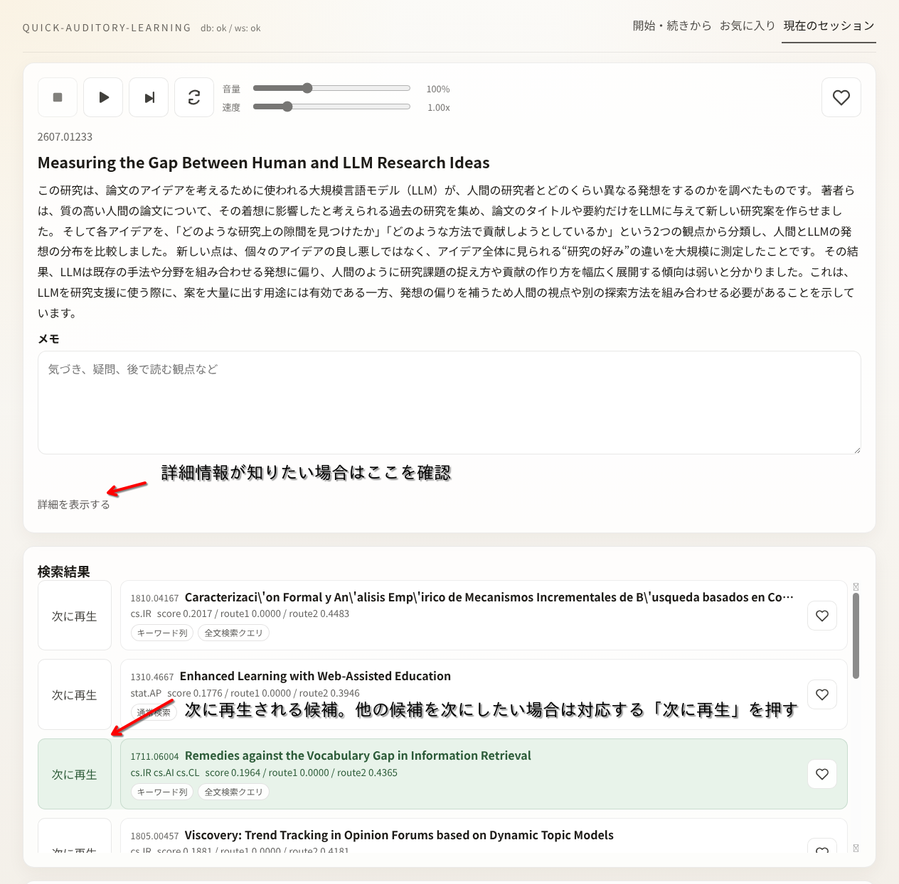
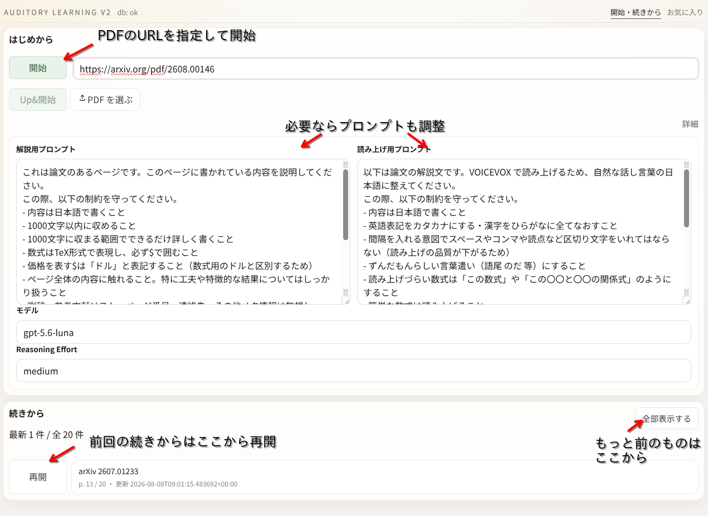

# Auditory Learning

## 概要

このリポジトリには、公開 PDF を AI に解説してもらうツールと、arXiv 論文を検索して連続再生する実験用ツールがあります。音声化には [VOICEVOX](https://voicevox.hiroshiba.jp/) を使用しています。

従来版の v1、PDF を読みながら AI の解説と音声を楽しめる v2、arXiv の JSONL データを扱う `quick-auditory-learning` を提供しています。





## 使い方

### v2

公開 PDF の URL または PDF ファイルから読み始め、PDF のプレビューとページごとの AI 解説を見ながら音声で聞けるツールです。

開始画面では新しい PDF を登録したり、以前に読んだ PDF を「続きから」再開したりできます。再生画面では解説と PDF のプレビューを並べて表示し、再生・一時停止、音量・速度の変更、ページ移動、再生成、お気に入り登録を操作できます。解説用プロンプト、読み上げ用プロンプト、モデル、Reasoning Effort も調整できます。

#### 想定環境

* 新しめの docker
* docker compose
* bash
* cpu アーキテクチャ: x86

#### 環境変数設定

ワークスペース直下の `.env` に `OPENAI_API_KEY` を設定してください。

既定モデルは `gpt-5.6-luna`、reasoning effort は `medium` です。変更する場合は、次の環境変数を設定します。

* `AUDITORY_LEARNING_V2_DEFAULT_MODEL_NAME`
* `AUDITORY_LEARNING_V2_DEFAULT_REASONING_EFFORT`

#### 起動

```
$ bash ./scripts/launch_v2.sh
```

起動したら http://localhost:5174 にアクセスしてください。backend、frontend、Postgres、VOICEVOX が Docker Compose で起動します。

停止する場合は次を実行します。

```
$ bash ./scripts/down_v2.sh
```

#### 操作方法

開始画面では、入力ボックスに対象とする PDF の URL を入力して「開始」をクリックしてください。PDF ファイルを選んで「Up&開始」をクリックすることもできます。



解説用プロンプト、読み上げ用プロンプト、モデル、Reasoning Effort は画面から調整できます。「続きから」では、以前の session を再開できます。

開始するとメイン画面が表示されます。再生、一時停止、次ページへの移動、再生成などをここから操作できます。長い PDF を順番に聞く場合は「再生同期」を使います。


### quick-auditory-learning

`arXiv` 論文のメタデータを取り込み、検索結果から解説文と音声を生成して、session 単位で連続再生する実験用ツールです。

#### 想定環境

* 新しめの docker
* docker compose
* bash
* arXiv メタデータの JSONL ファイル

#### 事前準備

Kaggle などから arXiv メタデータの JSONL ファイルを取得し、既定では次の場所に置いてください。

```
_data/quick_auditory_learning/arxiv.jsonl
```

Kaggle の `arxiv-dataset` を使う場合は、[Kaggle の arxiv データセット](https://www.kaggle.com/datasets/Cornell-University/arxiv) を利用できます。データセットの利用規約とライセンスも確認してください。

#### 環境変数設定

ワークスペース直下の `.env` に `OPENAI_API_KEY` を設定してください。JSONL を別の場所に置く場合は `QUICK_AUDITORY_LEARNING_JSONL_PATH` も設定します。

既定値は次のとおりです。

* JSONL: `_data/quick_auditory_learning/arxiv.jsonl`
* embedding model: `text-embedding-3-large`
* 解説生成モデル: `gpt-5.6-luna`
* reasoning effort: `medium`

#### 起動

```
$ bash ./scripts/launch_quick_auditory_learning.sh
```

起動したら http://localhost:5173 にアクセスしてください。

停止する場合は次を実行します。

```
$ bash ./scripts/down_quick_auditory_learning.sh
```

#### 操作方法

検索条件を入力して論文を検索し、候補から論文を選んでください。解説と音声を生成し、次の論文へ進みながら連続再生できます。同じ session を複数のブラウザで開いた場合は、操作と進行状態が同期します。


#### 制限

* arXiv メタデータの JSONL ファイルが必要です。
* JSONL は 1 行 1 JSON の形式で用意してください。
* 詳細なデータ準備、環境変数、モデル候補は [quick-auditory-learning/README.md](quick-auditory-learning/README.md) を参照してください。

## 過去バージョンについて

従来版の v1 の使い方、制限、操作方法は [v1/README.md](v1/README.md) を参照してください。

## 仕様と作業ログ

仕様・設計は [docs/](docs/) に、作業ログは [_worklist/](_worklist/) にあります。
