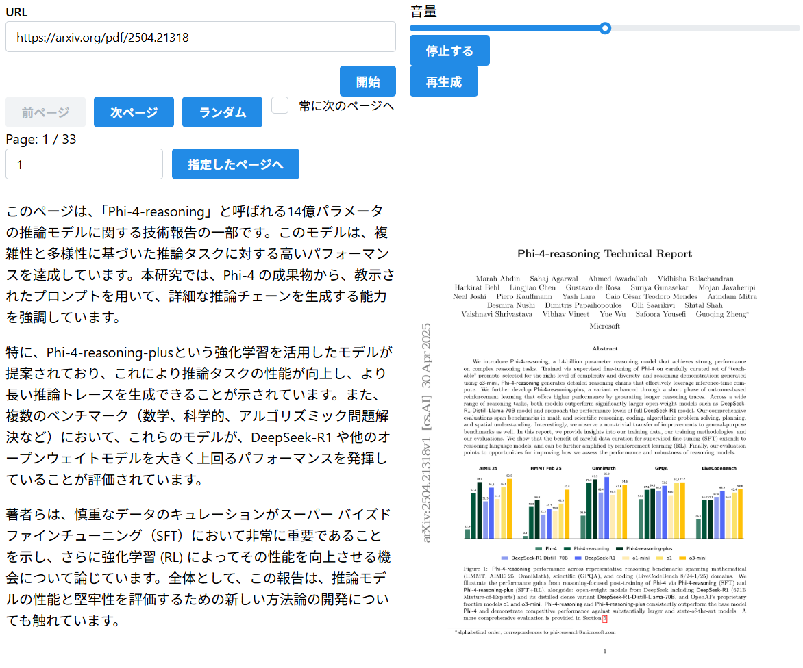

# Auditory Learning
## 概要
このツールは、PDFファイルをAIに解説してもらうツールです。音声化には[VOICEVOX](https://voicevox.hiroshiba.jp/)を使用しています。

以下のようなウェブUIを提供します。




## 使い方
### 想定環境
* 新しめのdocker
* cpuアーキテクチャ: x86
* linux（他環境での動作確認無し。wslでもいけるかも。arm/macは怪しい。）

### 事前準備(voicevox-engine)
[voicevox-engine](https://github.com/VOICEVOX/voicevox_engine) を利用します。
以下が実行例です。

#### gpu版の場合（十分なgpu環境設定が必要）
```
docker run --gpus all -d --rm \
  -p 50021:50021 \
  voicevox/voicevox_engine:nvidia-latest
```

#### cpu版の場合
```
docker run -d --rm \
  -p 50021:50021 \
  voicevox/voicevox_engine:cpu-latest
```


### 環境変数設定
.env ファイルを .env.example からコピーして環境変数を設定します。

特に、OPENAI_API_KEYの設定が必要です。

### 起動
```
$ bash ./scripts/launch_v1.sh
```

起動したら http://localhost:8000 にアクセスしてください。


### 操作方法

左上の入力ボックスに対象とするPDFファイルのURLを入力して「開始」をクリックしてください。しばらくすると再生が始まります。
「次ページ」で次のページに進みます。他のボタン等も試してみてください。


## 制限
* 既定モデルは `gpt-5.6-luna`、reasoning effort は `medium` です。`AUDITORY_LEARNING_DEFAULT_MODEL_NAME` と `AUDITORY_LEARNING_DEFAULT_REASONING_EFFORT` で変更できます。
* 実行時の PDF、画像、説明文、音声は `_data/v1/` に保存されます。
* 音声は ずんだもん 固定です。
* PDFのURLは公開されているものに限ります。ローカルファイルをアップロードすることはできません。
* 一部の公開 PDF サイトは通常の `wget` だと `403 Forbidden` になることがあります。アプリ側ではブラウザ相当の HTTP ヘッダで取得しますが、配信元の制限が強い URL は取得できない場合があります。
